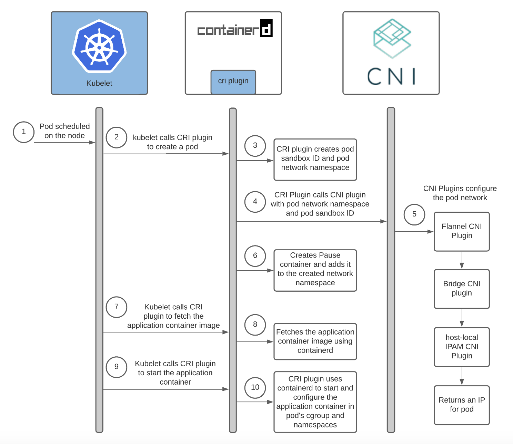

# Overview of Containerd, CNI, and CRI

Before diving into the specifics of the `containerd` configuration file, it’s important to understand the role that **Containerd**, **CNI**, and **CRI** play in the Kubernetes architecture.

## 1. Containerd

**Containerd** is a container runtime that handles the complete lifecycle of a container, including:
- Pulling container images.
- Managing container storage.
- Running, pausing, and stopping containers.
- Providing container networking through integration with CNI.

Containerd was originally a component within Docker but became a standalone project. It’s now widely used in Kubernetes to manage containers.

## 2. CRI (Container Runtime Interface)

**CRI** is a Kubernetes interface that allows the Kubernetes control plane (specifically the **kubelet**) to communicate with container runtimes like containerd, CRI-O, etc. The kubelet, which is responsible for managing nodes and pods, uses the CRI to:
- Instruct the container runtime to run or stop containers.
- Collect logs from containers.
- Set up networking through the runtime.

In this configuration file, the `cri` plugin within containerd enables Kubernetes to interact with containerd via the CRI.

## 3. CNI (Container Network Interface)

**CNI** is a specification and a set of plugins that provide networking capabilities for containers. Kubernetes uses CNI to:
- Assign IP addresses to pods.
- Set up network routing between pods and nodes.
- Manage container network interfaces.

CNI is an essential part of Kubernetes networking. Container runtimes (like containerd) rely on CNI to set up networking for the containers they manage.

# containerd-config.toml

This configuration file defines how **containerd** behaves, especially in relation to its integration with **CRI** and **CNI**. The configuration follows a structured, TOML format.

## Top-Level Configuration

```toml
version = 2
```

This specifies that the configuration file uses **version 2** of the containerd configuration schema.

## [plugins."io.containerd.grpc.v1.cri"]

```toml
[plugins."io.containerd.grpc.v1.cri"]
```

- This section enables the **CRI** (Container Runtime Interface) plugin within containerd.
- **io.containerd.grpc.v1.cri** is the CRI plugin for containerd, allowing Kubernetes to use the CRI API to manage containers running on the node.
- It allows kubelet to interact with containerd in a standardized way to schedule and manage pods.

---

## [plugins."io.containerd.grpc.v1.cri".containerd]

```toml
  [plugins."io.containerd.grpc.v1.cri".containerd]
    snapshotter = "overlayfs"
    default_runtime_name = "runc"
```

This subsection configures containerd-specific options:

1. **`snapshotter = "overlayfs"`**:
   - **Snapshotters** handle the container’s filesystem. They provide copy-on-write (COW) functionality, enabling fast creation of container layers by reusing existing layers.
   - **`overlayfs`** is a popular, lightweight, and efficient snapshotter that uses the Linux OverlayFS filesystem. It is used to manage container layers and images efficiently.

2. **`default_runtime_name = "runc"`**:
   - This sets the default container runtime to **runc**. 
   - **Runc** is a CLI tool for spawning and running containers according to the Open Container Initiative (OCI) runtime specification. It is the default runtime used by containerd for managing individual containers.

---

## [plugins."io.containerd.grpc.v1.cri".containerd.runtimes.runc]

```toml
  [plugins."io.containerd.grpc.v1.cri".containerd.runtimes.runc]
    runtime_type = "io.containerd.runc.v2"
```

- This subsection defines the configuration for the **`runc`** runtime that containerd uses by default. 
- **`runtime_type = "io.containerd.runc.v2"`** specifies that containerd should use the second version (`v2`) of the runc runtime.
  - **Runc v2** uses an improved runtime format to manage resources more efficiently.
  - It follows the OCI runtime specification and interacts directly with the Linux kernel to start and stop containers.

---

## [plugins."io.containerd.grpc.v1.cri".containerd.runtimes.runc.options]

```toml
  [plugins."io.containerd.grpc.v1.cri".containerd.runtimes.runc.options]
    SystemdCgroup = true
```

- **`SystemdCgroup = true`** tells containerd to use **systemd** as the cgroup manager.
- **Cgroups** (control groups) are a Linux kernel feature used to limit, monitor, and isolate resource usage (like CPU, memory) for a group of processes.
- **Systemd** is the Linux system and service manager. Setting `SystemdCgroup = true` means that containerd will use systemd to manage cgroups.
  - This is the recommended approach in modern Kubernetes clusters because it simplifies resource management and integrates better with system-level processes.

---

## [plugins."io.containerd.grpc.v1.cri".cni]

```toml
[plugins."io.containerd.grpc.v1.cri".cni]
  bin_dir = "/opt/cni/bin"
  conf_dir = "/etc/cni/net.d"
```

This section configures the integration between containerd and **CNI** for networking.

1. **`bin_dir = "/opt/cni/bin"`**:
   - This specifies the directory where the CNI plugin binaries are stored.
   - CNI plugins are executables that implement networking for containers. For example, plugins like **bridge** (for local node networking) and **loopback** (for container internal networking) are found in this directory.

2. **`conf_dir = "/etc/cni/net.d"`**:
   - This is the directory where the CNI configuration files are located. Configuration files like `10-bridge.conf` and `99-loopback.conf` reside here.
   - These configuration files define how networking is set up for containers (e.g., assigning IPs, setting up the bridge interface).

---

# Kubernetes Worker Node Networking

Kubernetes networking is crucial for the communication between components within and outside of a cluster. On worker nodes, networking must support:

- Communication between Pods, irrespective of their node.
- Pods' communication with services and external networks.
- The Kubernetes control plane (like the API server) communicating with worker nodes.

## Key Components

- **Container Runtime Interface (CRI):** Handles container execution.
- **Container Network Interface (CNI):** Manages networking aspects to ensure containers can communicate with each other and the outside world.
- **Containerd:** Manages the lifecycle of containers.

## Configuration Files

Two important configuration files for Kubernetes networking are `10-bridge.conf` and `99-loopback.conf`. These files configure two critical aspects of container networking:

1. **Bridge Network:** For inter-container communication.
2. **Loopback Network:** For internal communication within containers.

### 1. `10-bridge.conf`: Configuring the Bridge Network

This file sets up a bridge network using the CNI bridge plugin, creating a virtual network device for connecting containers on the same node.

#### Contents of `10-bridge.conf`

```json
{
  "cniVersion": "1.0.0",
  "name": "bridge",
  "type": "bridge",
  "bridge": "cni0",
  "isGateway": true,
  "ipMasq": true,
  "ipam": {
    "type": "host-local",
    "ranges": [
      [{"subnet": "SUBNET"}]
    ],
    "routes": [{"dst": "0.0.0.0/0"}]
  }
}
```

#### Breakdown:

- **`cniVersion`:** `"1.0.0"` - Specifies the CNI version.
- **`name`:** `"bridge"` - The name of this network configuration.
- **`type`:** `"bridge"` - Defines the bridge plugin to create a Linux bridge device (`cni0`).
- **`bridge`:** `"cni0"` - The bridge interface name on the worker node.
- **`isGateway`:** `true` - Allows the node to act as a gateway for outgoing traffic.
- **`ipMasq`:** `true` - Enables IP masquerading to hide pod IPs during external communication.
- **`ipam`:** - Manages IP address assignment.
  - **`type`:** `"host-local"` - Uses host-local plugin to assign IPs from a node-local range.
  - **`ranges`:** - Specifies the subnet for IP assignments.
  - **`routes`:** - Defines routing for outbound traffic.

#### How the Bridge Network Works:

- Containers connect to the `cni0` bridge on the worker node.
- Pods receive IP addresses from the node’s CIDR range.
- Pods on the same node communicate through the bridge.
- Outbound traffic is routed through the node's gateway to external networks.

### 2. `99-loopback.conf`: Configuring the Loopback Network

This file configures the loopback interface inside each container.

#### Contents of `99-loopback.conf`

```json
{
  "cniVersion": "1.1.0",
  "name": "lo",
  "type": "loopback"
}
```

#### Breakdown:

- **`cniVersion`:** `"1.1.0"` - Defines the CNI specification version.
- **`name`:** `"lo"` - Refers to the loopback interface.
- **`type`:** `"loopback"` - Configures the loopback interface inside each container.

#### How the Loopback Network Works:

- Each container has its own loopback interface (`lo`).
- Services inside the container can communicate via `127.0.0.1` (localhost).

## Relationship Between `10-bridge.conf` and `99-loopback.conf`

Together, these configurations:

- **Bridge Network:** Enables containers on the same node to communicate with each other.
- **Loopback Network:** Allows internal communication within each container.

These files ensure proper networking setup, allowing for effective container communication within and beyond the node.

## Kubelet, Container Runtime and CNI Plugins - how it’s all stitched together



## References

- [How a Kubernetes Pod Gets an IP Address](https://ronaknathani.com/blog/2020/08/how-a-kubernetes-pod-gets-an-ip-address/)
- [CRI Architecture](https://github.com/containerd/cri/blob/v1.11.1/docs/architecture.md)
- [Container Networking](https://blog.mbrt.dev/posts/container-network/)
