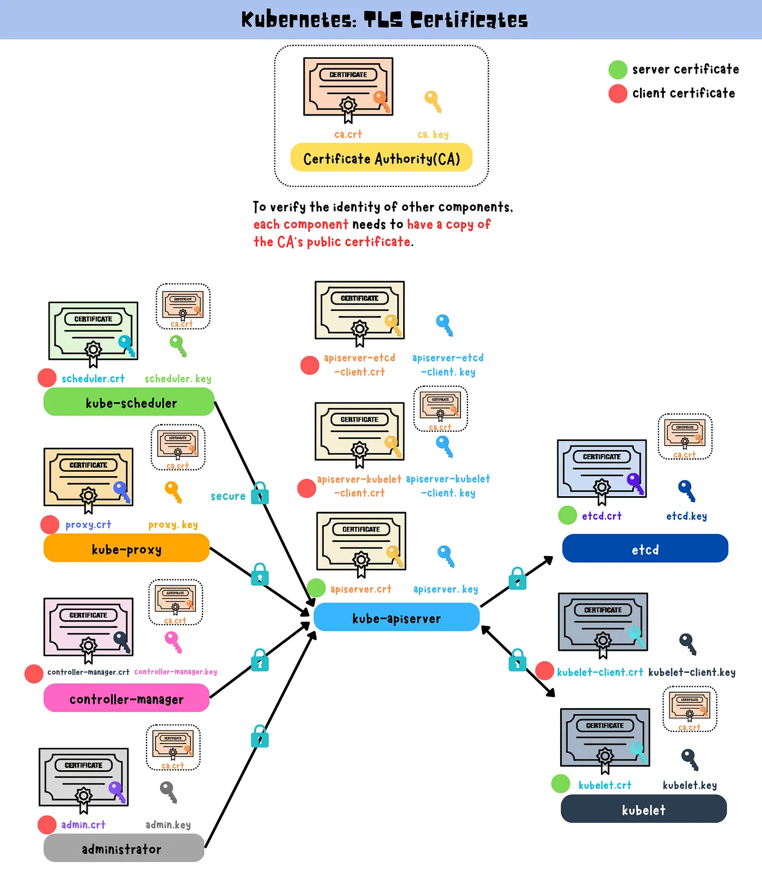

# Kubernetes PKI and TLS Certificate Generation Guide

This guide outlines how to provision a Public Key Infrastructure (PKI) using OpenSSL to bootstrap a Certificate Authority (CA) and generate TLS certificates for Kubernetes components like `kube-apiserver`, `kube-scheduler`, `kube-controller-manager`, `kubelet`, and `kube-proxy`. These components rely on TLS certificates for secure communication.

## Table of Contents

1. [Introduction to PKI](#introduction-to-pki)
2. [Certificate Authority (CA) Setup](#certificate-authority-ca-setup)
3. [Generating Client and Server Certificates](#generating-client-and-server-certificates)
4. [Distributing Certificates](#distributing-certificates)
5. [Kubernetes Component Communication](#kubernetes-component-communication)
6. [Commands Cheat Sheet](#commands-cheat-sheet)
7. [References](#references)

---

## Introduction to PKI

Public Key Infrastructure (PKI) enables secure communication in Kubernetes by issuing, managing, and verifying TLS certificates. Each Kubernetes component must be authenticated and communicate over secure channels using certificates.

In Kubernetes:
- **kube-apiserver**: Exposes the Kubernetes API.
- **kube-scheduler**: Assigns workloads to nodes.
- **kube-controller-manager**: Oversees controllers.
- **kubelet**: Manages node-level operations.
- **kube-proxy**: Routes network traffic to services.

All of these components need certificates for mutual authentication and secure communication.

---

## Certificate Authority (CA) Setup

A **Certificate Authority (CA)** issues certificates for the Kubernetes components. We'll generate a private key for the CA and create a self-signed root certificate.

### Steps:

1. Generate the CA private key:
   ```bash
   openssl genrsa -out ca.key 4096
   ```

2. Generate the CA certificate:
   ```bash
   openssl req -x509 -new -sha512 -noenc        -key ca.key -days 3653        -config ca.conf        -out ca.crt
   ```

   - **`ca.key`**: The CA’s private key.
   - **`ca.crt`**: The self-signed root certificate valid for 10 years.

---

## Generating Client and Server Certificates

For each Kubernetes component, a certificate must be generated and signed by the CA. The certificate must support both client and server roles, depending on the component's function.

### Steps for Each Component:

1. Generate the private key:
   ```bash
   openssl genrsa -out <component>.key 4096
   ```

2. Create a Certificate Signing Request (CSR):
   ```bash
   openssl req -new -key <component>.key -sha256        -config ca.conf -section <component>        -out <component>.csr
   ```

3. Sign the certificate using the CA:
   ```bash
   openssl x509 -req -days 3653 -in <component>.csr        -copy_extensions copyall -sha256        -CA ca.crt -CAkey ca.key -CAcreateserial        -out <component>.crt
   ```

4. The files generated will be:
   - `<component>.key`: The private key.
   - `<component>.csr`: The certificate signing request.
   - `<component>.crt`: The signed certificate.

---

## Distributing Certificates

After generating the certificates for each component, distribute them to their respective nodes for use.

### Worker Nodes (`node-0` and `node-1`):

```bash
for host in node-0 node-1; do
  ssh root@$host mkdir /var/lib/kubelet/
  
  scp ca.crt root@$host:/var/lib/kubelet/
  scp $host.crt root@$host:/var/lib/kubelet/kubelet.crt
  scp $host.key root@$host:/var/lib/kubelet/kubelet.key
done
```

### API Server Node:

```bash
scp ca.key ca.crt kube-api-server.key kube-api-server.crt     service-accounts.key service-accounts.crt     root@server:~/
```

---

## Kubernetes Component Communication

Kubernetes components communicate using the TLS certificates generated by the CA. Here's how the components interact:

- **Kubelet** uses its certificate to authenticate to the **kube-apiserver**.
- **kube-apiserver** authenticates the **kube-scheduler** and **kube-controller-manager**.
- **kube-proxy** uses its certificate for secure communication with the **kube-apiserver**.
- **Service Accounts** use their certificates for token signing.

The diagram below illustrates the communication and interactions between Kubernetes components using the certificates.



---

## Commands Cheat Sheet

| **Task**                           | **Command**                                                                                             |
|-------------------------------------|---------------------------------------------------------------------------------------------------------|
| **Generate CA Private Key**         | `openssl genrsa -out ca.key 4096`                                                                        |
| **Generate CA Certificate**         | `openssl req -x509 -new -sha512 -noenc -key ca.key -days 3653 -config ca.conf -out ca.crt`               |
| **Generate Private Key for Component** | `openssl genrsa -out <component>.key 4096`                                                              |
| **Generate CSR for Component**      | `openssl req -new -key <component>.key -sha256 -config ca.conf -section <component> -out <component>.csr`|
| **Sign Certificate with CA**        | `openssl x509 -req -days 3653 -in <component>.csr -copy_extensions copyall -sha256 -CA ca.crt -CAkey ca.key -CAcreateserial -out <component>.crt`|

---

## References

- [Kubernetes Documentation on Certificates](https://kubernetes.io/docs/concepts/cluster-administration/certificates/)
- [Kubernetes: TLS certificates](https://yuminlee2.medium.com/kubernetes-tls-certificates-b75fee80670d)
- [OpenSSL Man Pages](https://www.openssl.org/docs/man1.1.1/)
- [Public Key Infrastructure](https://en.wikipedia.org/wiki/Public_key_infrastructure)
